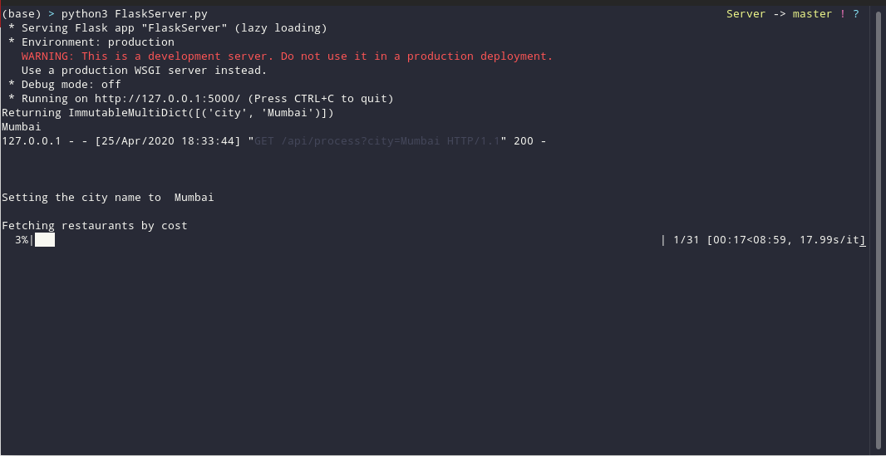

# Backend Repostiory for web app: RestaurantTrends.stats 

This repostiory is the backend server code for powering the web app RestaurantTrends.stats: https://github.com/rahul-jha98/RestaurantTrends.stats

## Understanding the role of the Backend:

 - **FlaskServer.py**: This file is the Flask Server which will provide the API for the frontend to request new anlysis of a given city name. Whenever a city is requested we spawn a new child process and tell it to execute ZomatoDataAnalyzer passing in the city name as param. This way if we have more than one requests we can handle it with multiple child processes.
 - **ZomatoDataAnalyzer.py** : This file has two responsibilities. First it uses the Zomato API and web scraping to prepare a csv of necessary information for a given city. Then we read the csv and perform data analysis on it. All the plots are saved in a directory and a dictionary containing the titles is also dumped in a json. 
 With both of these done we have our analysis done. But the data has to be uploaded to firebase for our frontend to access it. So, what we do is we call a node file DataUploader.js to upload the data to firebase storage.
 - **DataUploader.js** : This part handles the job of uploading the files to firebase storage and save the link to it in firebase for our frontend to access. 
 

The reason we chose this apporach is that the Data Analysis requires lot of dependecies and good computing power which would mean the cost of such server would be higher. On the other hand for simply fetching the images the extra computing power is not necessary. So, separating the data hosting backend from analysis we ensure that the very low sized server with good CPU can be used to host this one since images and data are not permanently saved here. 
